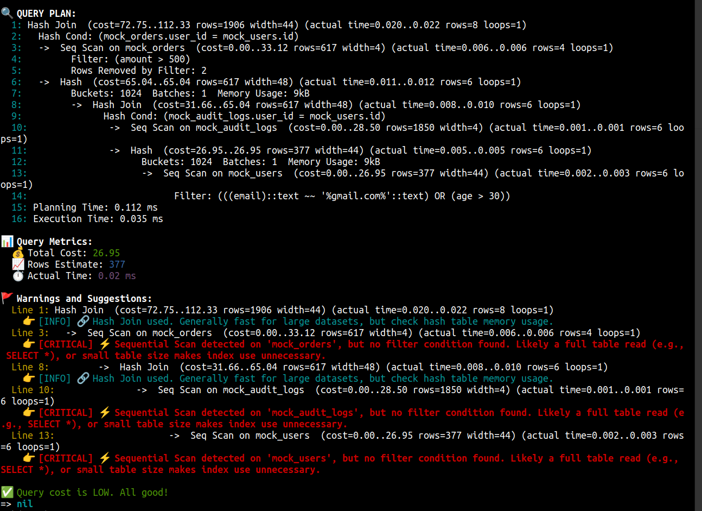

# SqlQueryAnalyzer

[](https://badge.fury.io/rb/sql_query_analyzer)
[](https://github.com/anoobbava/sql_query_analyzer)
[](https://github.com/anoobbava/sql_query_analyzer)

Analyze your ActiveRecord queries easily with EXPLAIN and smart optimization suggestions. 🚀

**✅ Supports Rails 6.0+ through Rails 7.1+**

---

## Compatibility

| Rails Version | Ruby Version | Status |
|---------------|--------------|---------|
| 6.0.x         | 3.0+         | ✅ Fully Supported |
| 6.1.x         | 3.0+         | ✅ Fully Supported |
| 7.0.x         | 3.0+         | ✅ Fully Supported |
| 7.1.x         | 3.1+         | ✅ Fully Supported |

## Installation

Add this line to your Gemfile:

```ruby
gem 'sql_query_analyzer'
```

And then execute:

```ruby
bundle install
```

Or install it manually:

```
gem install sql_query_analyzer
```

Need to create a new file in the config/initializers/sql_query_analyzer.rb


## Usage
In your Rails console or app:

```ruby
User.where(active: true).explain_with_suggestions

```


✅ You will get:

- Full EXPLAIN ANALYZE plan

- Smart suggestions like:
    - Missing JOIN conditions
    - Sorting without indexes
    - High row scan warnings


### Why Use This Gem?

- Save time analyzing slow queries
- Instant smart hints
- Improve database performance faster
- Beginner-friendly explanations


### Example Output

```mathematica
=== EXPLAIN ANALYZE OUTPUT ===
Seq Scan on users ...

=== SUGGESTIONS ===
[CRITICAL] ⚡ Sequential Scan detected. Consider adding indexes.
[WARNING] 🚨 Query uses SELECT *. Select only needed columns.
```


### Example Output using dummy queries

Here is an example of the output response from the Gem:




## Code Coverage

The project maintains high test coverage to ensure reliability:

- **Line Coverage**: 99.4% (167/168 lines)
- **Branch Coverage**: 80.7% (46/57 branches)

Coverage is measured using SimpleCov and is checked on every pull request.


## Roadmap
For a detailed roadmap, visit [our GitHub Pages roadmap](https://github.com/anoobbava/sql_query_analyzer/blob/master/ROADMAP.md).